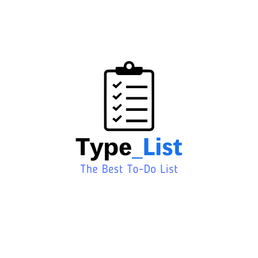

# Type_List

A minimalist, feature-rich todo list application that helps you stay organized and productive. Built with vanilla JavaScript, HTML, and CSS, Type_List offers a clean interface and powerful features while maintaining simplicity.



## 🌟 Features

- **Smart Tagging System**: Organize tasks with hashtags (e.g., #work, #personal)
- **Dark/Light Mode**: Toggle between themes for comfortable viewing
- **Local Storage**: Your tasks persist even after closing the browser
- **URL Detection**: Automatically converts URLs into clickable links
- **Search Integration**: Use @ for Google search and ? for auto-complete
- **Future You Messages**: Get encouraging messages when completing tasks
- **Progressive Web App**: Install and use offline
- **Responsive Design**: Works seamlessly on all devices

## 🚀 Installation

### Web Version
Simply visit [Type_List](https://your-domain.com) in your browser.

### PWA Installation
1. Visit the website
2. Click the download icon in the header
3. Follow your browser's installation prompt

## 💻 Usage

### Adding Tasks
- Type your task in the input field
- Press Enter or click the + button
- Add hashtags to categorize tasks (e.g., "Buy groceries #shopping")

### Task Management
- Click the checkbox to mark a task as complete
- Click the × button to delete a task
- Use the filter buttons to view different task states
- Click on tags to filter tasks by category

### Special Commands
- Start with @ to create a Google search link
- Start with ? to create an auto-complete search link
- Add URLs directly to create clickable links

### Theme Toggle
- Click the moon/sun icon to switch between dark and light modes

## 🔧 Development

### Prerequisites
- A modern web browser
- Basic understanding of HTML, CSS, and JavaScript

### Local Setup
1. Clone the repository:
   ```bash
   git clone https://github.com/yourusername/Type_List.git
   ```
2. Navigate to the project directory:
   ```bash
   cd Type_List
   ```
3. Open `index.html` in your browser or use a local server

### Project Structure
```
Type_List/
├── index.html          # Main HTML file
├── styles.css          # CSS styles
├── script.js           # JavaScript functionality
├── manifest.json       # PWA manifest
├── service-worker.js   # Service worker for offline support
└── Typecode/          # Assets directory
    └── 1.png          # App icon
```

## 🤝 Contributing

Contributions are welcome! Please feel free to submit a Pull Request.

1. Fork the repository
2. Create your feature branch (`git checkout -b feature/AmazingFeature`)
3. Commit your changes (`git commit -m 'Add some AmazingFeature'`)
4. Push to the branch (`git push origin feature/AmazingFeature`)
5. Open a Pull Request

## 📝 License

This project is licensed under the MIT License - see the [LICENSE](LICENSE) file for details.

## 🙏 Acknowledgments

- Font Awesome for icons
- Google for search integration
- All contributors and users of Type_List

## 📧 Contact

Eri R Jorge - [@Tachi_exe](https://x.com/Tachi_exe)
........... - [@tachi_bana.exe](https://www.instagram.com/tachi_bana.exe/)
........... - [tachi_bana.exe](502441488001531915)
